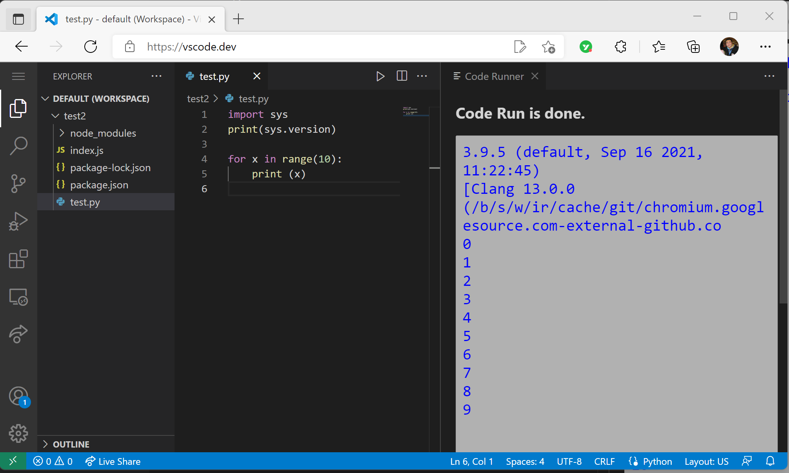

# Code Runner for Web

Run code in browser: Python

## Usages

* To run code:
  * open **Command Palette** (<kbd>Ctrl+Shift+P</kbd>), then type `Run Code in Web`, 
  * or right click the Text Editor and then click `Run Code in Web` in editor context menu
  * or click `Run Code  in Web` button in editor title menu

## Limitation

* Only support Python standard library
* Only support running single Python file